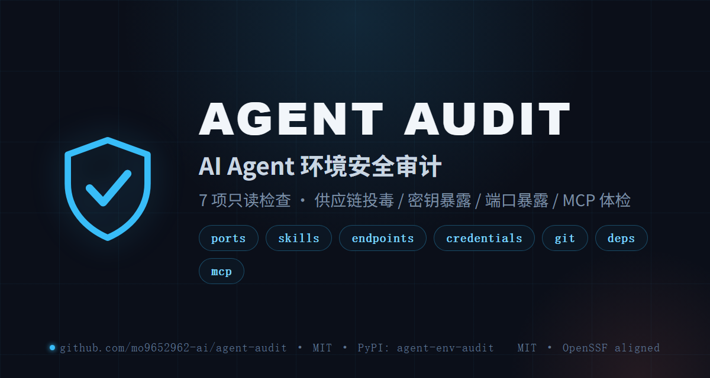

<div align="center">

  

  # AGENT AUDIT

  **Permission boundaries · Data destinations · Key hygiene — one-shot audit for your AI Agent environment**

  **agent-audit is an open-source, read-only CLI that audits your local AI Agent environment in one shot: 7 checks covering supply-chain poisoning, plaintext secrets, port exposure, git leakage, dependency vulnerabilities, and the MCP server attack surface. Judgments align with OWASP / NSA CSI / the official MCP security guide. Zero runtime dependencies. Windows-first.**

  <p>
    <a href="README.md">🇨🇳 中文</a>
    ·
    <a href="https://github.com/marketplace/actions/agent-audit">🛒 GitHub Marketplace</a>
    ·
    <a href="docs/mcp-security-audit-whitepaper.md">📖 MCP Audit Whitepaper</a>
    ·
    <a href="LICENSE">MIT</a>
  </p>

  <p>
    <a href="https://github.com/mo9652962-ai/agent-audit/actions/workflows/ci.yml"></a>
    <a href="https://github.com/mo9652962-ai/agent-audit/actions/workflows/codeql.yml"></a>
    <a href="https://pypi.org/project/agent-env-audit/"></a>
    <a href="https://www.bestpractices.dev/projects/15101"></a>
    <a href="https://github.com/marketplace/actions/agent-audit"></a>
  </p>
</div>

<div align="center">
  
</div>

## Why (2026 field background)

- **ClawHavoc skill poisoning**: 800+ malicious skills at the Feb 2026 peak; Snyk audited 3,984 ClawHub skills — **13.4% had severe security issues, 36.8% had vulnerabilities**. Market-installed skills run with the same permissions as you (terminal / file / web).
- **Port exposure**: OpenClaw listens on `0.0.0.0:18789` by default — **85% of instances exposed publicly** per CFC CERT; 1,000+ ComfyUI instances conscripted into botnets.
- **Info-stealers**: Vidar variants specifically **target agent config directories** (tokens / private keys).
- **Dependency poisoning**: the 2026-03 LiteLLM / Axios / Apifox / Trivy incidents hit multiple agent apps.
- **MCP attack surface**: remote / unauthenticated / unknown-npm-package MCP servers are the new entry point.

## ✨ The 7 checks

| # | Check | Pass criteria |
|:--|:--|:--|
| 1 | Port exposure | Services must bind 127.0.0.1 only — any 0.0.0.0 wildcard is flagged |
| 2 | Skill provenance | Market-installed (`@`-prefixed) skills = highest supply-chain risk |
| 3 | Egress endpoints | All endpoints must be official APIs or loopback; tunnels/unknown domains flagged |
| 4 | Credential hygiene | Keys in config files are normal; real values in memory docs + wide `.env` ACLs are not |
| 5 | Git leakage | Tracked `.env`/`config.yaml` = critical; `.gitignore` must carry key rules |
| 6 | Dependency audit | uv audit / pip-audit against known CVEs |
| 7 | MCP server audit | Trusted source · no remote · authenticated · disabled when idle (OWASP / NSA CSI aligned) |

## 🚀 Quick start

```bash
pip install agent-env-audit
agent-audit
# Markdown + JSON reports land in ./agent-audit-reports/
```

Exit code is `1` when findings reach `--severity-threshold` (default `high`) — usable as a CI gate.

## 🖥 Use in CI (GitHub Action)

Listed on the [GitHub Marketplace](https://github.com/marketplace/actions/agent-audit):

```yaml
- uses: mo9652962-ai/agent-audit-action@v1.0.2
  with:
    severity-threshold: high
```

Runs git-leak + dependency-vulnerability checks on every PR; reports (md + json) are uploaded as artifacts.

## 🧭 Methodology

The MCP audit checklist aligns with [OWASP's Secure MCP Server Development guide](https://genai.owasp.org/resource/a-practical-guide-for-secure-mcp-server-development/), the [NSA Cybersecurity Information Sheet on MCP Security (2026-06)](https://media.defense.gov/2026/Jun/02/2003943289/-1/-1/0/CSI_MCP_SECURITY.PDF), and the [official MCP Security Best Practices (2026-07-28 spec)](https://modelcontextprotocol.io/docs/2026-07-28/tutorials/security/security_best_practices). Covered: trusted source, no remote servers, auth fields, idle-disabled. Not yet automated (roadmap): tool poisoning/shadowing, token passthrough, MCP config file permissions.

## 🛡 Security

Please report vulnerabilities privately via [GitHub Security Advisories](https://github.com/mo9652962-ai/agent-audit/security/advisories/new) — response within 7 days. See [SECURITY.md](SECURITY.md).

## License

MIT
