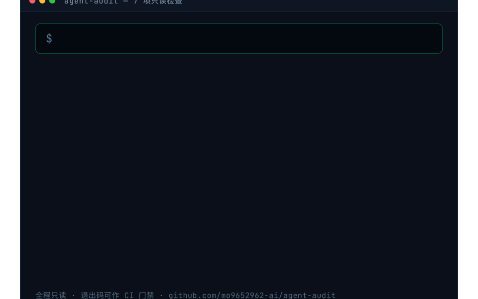

<div align="center">

  

  # AGENT AUDIT

  **权限边界 · 数据去向 · 密钥卫生——AI Agent 环境的一键体检**

  **agent-audit 是开源的本地 AI Agent 环境安全审计 CLI：7 项只读检查覆盖供应链投毒、明文密钥、端口暴露、git 泄漏、依赖漏洞与 MCP server 攻击面。判定标准对照 OWASP / NSA CSI / MCP 官方安全指南，全程只读、零运行时依赖、Windows 优先。**

  <p>
    <a href="https://github.com/marketplace/actions/agent-audit">🛒 GitHub Marketplace</a>
    ·
    <a href="README.en.md">English</a>
    ·
    <a href="docs/mcp-security-audit-whitepaper.md">📖 MCP 审计白皮书</a>
    ·
    <a href="docs/cii-best-practices-answers.md">🏆 OpenSSF 证据清单</a>
    ·
    <a href="LICENSE">MIT</a>
  </p>

  <p>
    <a href="https://github.com/mo9652962-ai/agent-audit/actions/workflows/ci.yml"></a>
    <a href="https://github.com/mo9652962-ai/agent-audit/actions/workflows/codeql.yml"></a>
    <a href="https://pypi.org/project/agent-env-audit/"></a>
    
    
    <a href="LICENSE"></a>
    <a href="https://www.bestpractices.dev/projects/15101"></a>
    <a href="https://github.com/marketplace/actions/agent-audit"></a>
  </p>
</div>

<div align="center">
  <a href="">
    
  </a>
</div>

<div align="center">
  <a href=""></a>
  <p><sub>▲ 7 项检查逐条输出 · 退出码可直接作 CI 门禁（本片为示例数据）</sub></p>
</div>

<div align="center">

### ⭐ 如果 agent-audit 对你有帮助，点个 Star 就是最大的支持

[](https://github.com/mo9652962-ai/agent-audit/stargazers)
[](LICENSE)
[](https://github.com/mo9652962-ai/agent-audit/actions)
[](https://github.com/mo9652962-ai/agent-audit/releases)

[](https://star-history.com/#mo9652962-ai/agent-audit&Date)

</div>

## 🌐 English

**agent-audit** is a zero-dependency, read-only CLI that audits your local AI agent environment in one shot: supply-chain poisoning (market-installed skills), plaintext secrets & credential file permissions, port exposure, git-tracked secrets, known dependency vulnerabilities, and MCP server security (OWASP-aligned). Windows-first (`icacls` / `netstat` / `tasklist` are first-class citizens); works on Linux/macOS too. Also available as a [GitHub Action](https://github.com/marketplace/actions/agent-audit).

## 🚨 为什么需要它（2026 实战背景）

- **ClawHavoc 供应链投毒**：800+ 恶意 skill 泛滥（2026-02 顶峰）；Snyk 审计 ClawHub 3984 技能中 **13.4% 含严重安全问题，36.8% 有漏洞**。市场导入 skill 拥有与用户同等的执行权限（terminal / file / web）。
- **端口暴露**：OpenClaw 默认监听 `0.0.0.0:18789`，国家应急中心通报 **85% 实例暴露公网**；ComfyUI 1000+ 暴露实例被组僵尸网络挖矿。
- **窃密木马**：Vidar 变种**专偷 agent 配置目录**（token / private key）。
- **依赖投毒**：2026-03 LiteLLM / Axios / Apifox / Trivy 投毒波及多个 agent 应用。
- **MCP 攻击面**：MCP 已成 agent 连接工具数据的事实标准，远程 / 无鉴权 / 未知名 npm 包 MCP server 是新入口。

## ✨ 7 项检查

| # | 检查 | 判定标准 | 典型发现 |
|:--|:--|:--|:--|
| 1 | **端口暴露检查** | 服务只允许监听 127.0.0.1，严禁 0.0.0.0 通配 | OpenClaw 网关 / ComfyUI 绑定所有网卡 |
| 2 | **Skill 来源分类审计** | 市场导入 skill（@ 前缀）= 最高供应链风险 | 800+ 恶意 skill 事件中的同款来源 |
| 3 | **外发端点白名单** | 全部端点应为官方 API 或本地回环 | trycloudflare 隧道、未知域名、IP 直连 |
| 4 | **凭据权限与明文** | config.yaml 存 key 正常；记忆文档里的真实值 + .env 权限过宽才是问题 | Vidar 变种专偷 agent 配置目录 |
| 5 | **Git 泄漏检查** | .env / config.yaml 被追踪 = critical；.gitignore 必须有密钥规则 | auto-sync 把一切未忽略文件提交出去 |
| 6 | **依赖漏洞审计** | uv audit / pip-audit 扫描已知漏洞 | 2026-03 LiteLLM / Axios 投毒 |
| 7 | **MCP Server 审计** | 来源可信 · 无远程 · 带鉴权 · 闲置禁用（对照 OWASP / NSA CSI） | 公网 URL、未知名 npm 包、无鉴权端点 |

## 🚀 3 步快速开始

```bash
# 1. 安装（PyPI · 运行时零依赖）
pip install agent-env-audit

# 2. 一键体检（默认审计 Hermes 环境 + 当前工作区）
agent-audit

# 3. 读报告：Markdown + JSON 双输出在 ./agent-audit-reports/
```

<details>
<summary><b>更多安装方式与常用参数</b></summary>

```bash
# 或从源码 / 免安装
pip install git+https://github.com/mo9652962-ai/agent-audit.git
git clone https://github.com/mo9652962-ai/agent-audit.git && cd agent-audit && PYTHONPATH=src python -m agent_audit

# 只跑部分检查 + 指定判定阈值
agent-audit --checks ports,credentials --severity-threshold high

# 报告只出 JSON（CI 机读）
agent-audit --format json -o ./reports
```

| 参数 | 默认 | 说明 |
|:--|:--|:--|
| `--checks` | 全部 7 项 | 逗号分隔：ports,skills,endpoints,credentials,git,deps,mcp |
| `--format` | `md,json` | 报告格式 |
| `--severity-threshold` | `high` | 达到该严重度退出码为 1（CI 门禁） |
| `-c/--config` | — | TOML 配置（paths / ports / endpoints 段） |
| `-o/--output-dir` | `agent-audit-reports` | 报告输出目录 |
</details>

## 🖥 在 CI 里用（GitHub Action）

已上架 [GitHub Marketplace](https://github.com/marketplace/actions/agent-audit)——PR 时自动跑 **git 泄漏检查 + 依赖漏洞扫描**，发现 ≥ 阈值级问题即失败：

```yaml
- uses: mo9652962-ai/agent-audit-action@v1.0.2
  with:
    severity-threshold: high
```

详见 [action/README.md](action/README.md)。本仓库自己的 CI 每次 push 都在用它审计自己（dogfood）。

## ⚙️ 配置文件（可选）

```toml
# audit.toml —— 全部可省略
[paths]
skills_dirs = ["C:/Users/me/.agents/skills"]
config_dirs = ["C:/Users/me/AppData/Local/hermes"]

[ports]
watch = { 18789 = "OpenClaw 网关", 8188 = "ComfyUI" }
system_noise = [135, 445, 5040]

[endpoints]
whitelist = ["corp.internal"]
```

## 🧭 方法论依据

MCP 审计判定清单（检查 7）与以下权威指南对齐（2026-09 核对）：

- [OWASP: A Practical Guide for Secure MCP Server Development](https://genai.owasp.org/resource/a-practical-guide-for-secure-mcp-server-development/)
- [NSA Cybersecurity Information Sheet: MCP Security（2026-06）](https://media.defense.gov/2026/Jun/02/2003943289/-1/-1/0/CSI_MCP_SECURITY.PDF)
- [MCP 官方 Security Best Practices（2026-07-28 spec）](https://modelcontextprotocol.io/docs/2026-07-28/tutorials/security/security_best_practices)

已工具化覆盖：来源可信、无远程 MCP、鉴权字段、闲置禁用。NSA 清单中尚未工具化的项（tool poisoning / shadowing、token passthrough）见 Roadmap。

## 🎬 系列视频（抖音 · Agent 安全审计）

| 期 | 主题 | 数据钩子 |
|:--|:--|:--|
| 1 | 本机端口暴露 | 8 个高危报警，只有 2 个是真的 |
| 2 | MCP 供应链审计 | 每一个 MCP 都是一扇门 |
| 3 | skill 供应链投毒 | 800+ 恶意 skill 同时上线 |
| 4 | 凭据卫生 | 113 处密钥命中，先别慌 |

## 📖 文档

- [MCP Server 安全审计白皮书](docs/mcp-security-audit-whitepaper.md) — 5 项 OWASP 对齐判定清单
- [系列文章：我给自己的 AI Agent 环境做了次安全审计](blog/01-self-audit-report.md)
- [CII Best Practices 答案清单](docs/cii-best-practices-answers.md) — OpenSSF badge 逐条证据对照

## 🗺 Roadmap

- [ ] `skill-vetter` 集成：skill 安装前审查
- [ ] `--fix` 模式：一键收紧权限 / 改监听（带确认）
- [ ] OWASP Agentic AI Top 10 完整映射
- [x] GitHub Action：PR 时自动跑依赖 + git 泄漏检查
- [ ] MCP 检查扩展：tool poisoning / shadowing、token passthrough、MCP 配置文件权限（NSA CSI 清单）
- [ ] README 完整英文翻译

## 🛡 Security

发现漏洞请勿开公开 issue——走 [GitHub Security Advisories](https://github.com/mo9652962-ai/agent-audit/security/advisories/new) 私密报告，7 天内响应。设计边界与已知限制见 [SECURITY.md](SECURITY.md)。

## 🤝 贡献

PR 欢迎，规范见 [CONTRIBUTING.md](CONTRIBUTING.md)（Actions SHA 固定 / 覆盖率棘轮 / 测试政策 / 密钥卫生）。

## License

MIT

---

📌 **更多**：[作者仓库矩阵](https://github.com/mo9652962-ai)（墨题刷题机 / 第二大脑 / 安全三部曲 / 孵化线）
